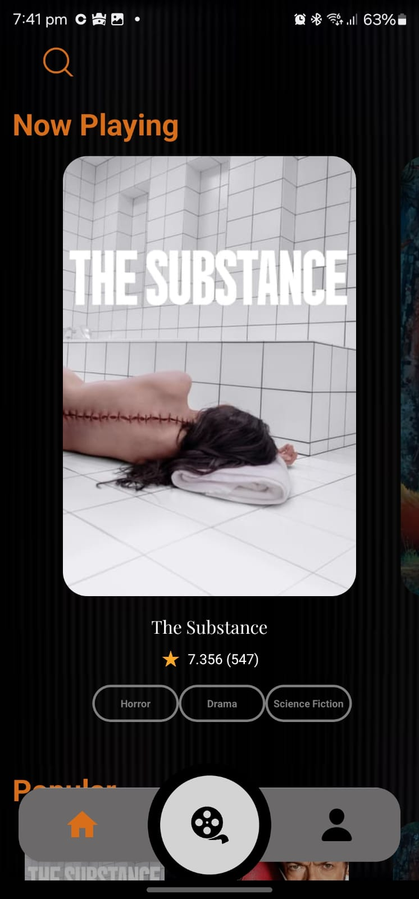
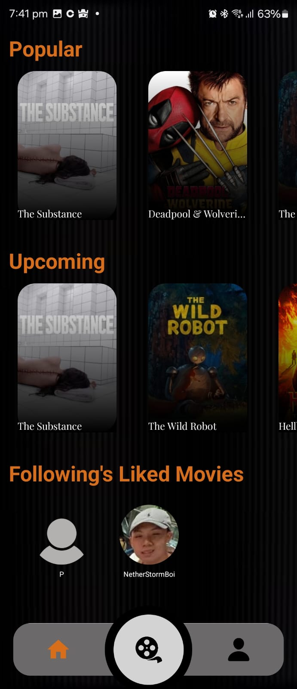
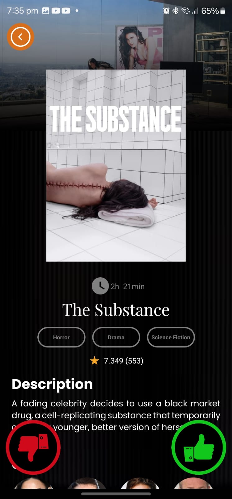
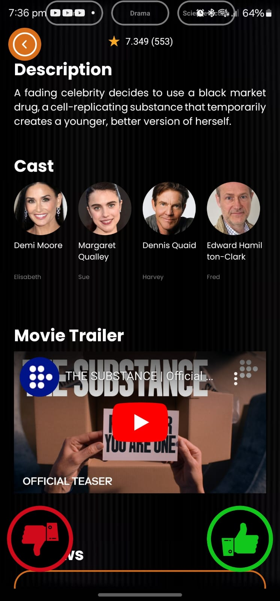
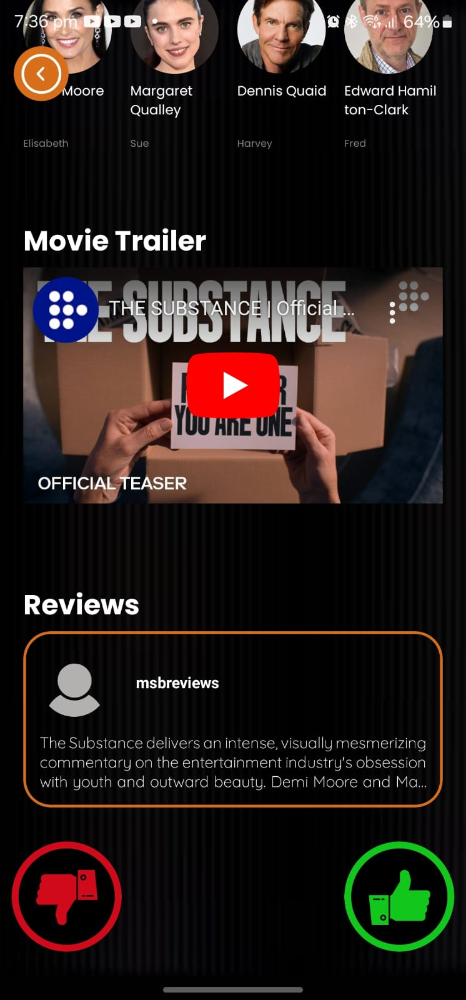
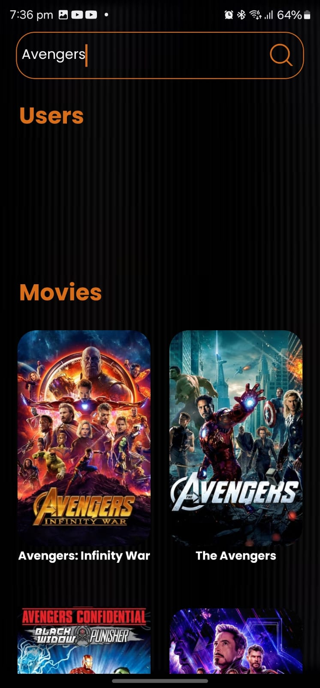
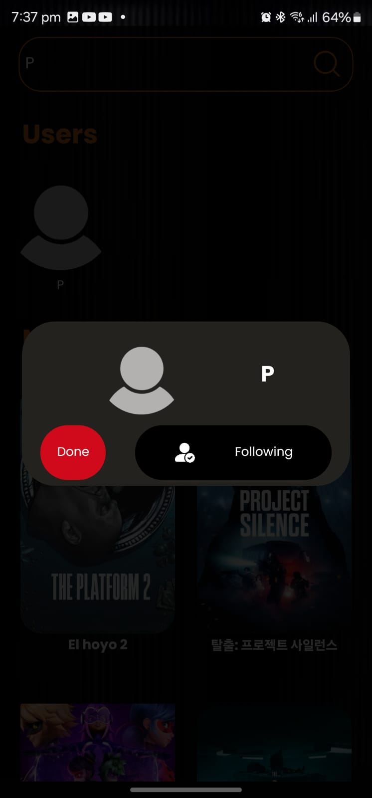

# **SwipeForMovie**

> An app that will recommend you movies based on your liked movies. It uses a Tinder like style to swipe right/left to add to your liked movies and disliked movies.

## Table of Contents
- [About the Project](#about-the-project)
- [Built With](#built-with)
- [Features](#features)
- [Screenshots](#screenshots)
- [Installation](#installation)
- [Contact](#contact)

## About the Project
### This app aims to be a place where a user can come to when he/she does not know what movie to watch and is looking for an inspiration. He can immediately go to the recommendation screen to just swipe right/left to get movies tailored to him using Machine Learning that dynamically gets better as the user uses the app more.

### Built With
- Firebase for Authentication and store user's name and profile image
- Supabase for storing the user's liked/disliked movies. It also stores multiple movies that will be used for the SuggestMe screen to suggest the user with movies tailored to him/her
- Uses the database provided by TMDB for the details and posters for the different movies

## Features
- Feature 1: SuggestMe screen suggests movies according to the user's liked movies
- Feature 2: Able to search up movies to see their overview, cast details, trailer and reviews
- Feature 3: Able to like and dislike movies to further curate movies recommended to you
- Feature 4: Able to see the liked movies of users that you search up and follow on the app

## Screenshots
<table>
  <tr>
    <td></td>
    <td></td>
  </tr>
  <tr>
    <td></td>
    <td></td>
  </tr>
  <tr>
    <td></td>
    <td></td>
  </tr>
  <tr>
    <td></td>
  </tr>
</table>

## Installation
[Download APK from Google Drive](https://drive.google.com/file/d/1JPYMHgvkblgLkPW5qetl5eRpsTwnSObf/view?usp=drive_link)

## Contact
*Email:* adormantsakthi@gmail.com
